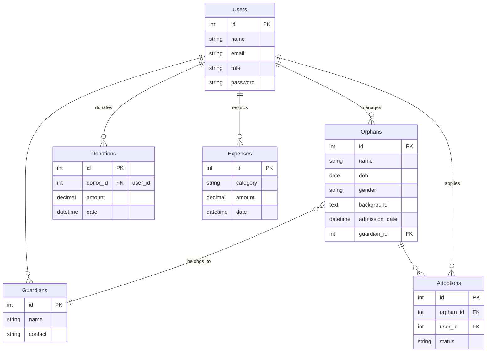
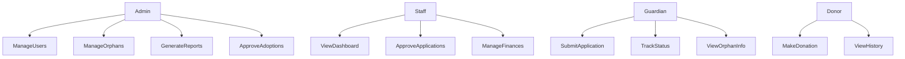

# Orphanage Management Information System

As a professional system analyst with over 10 years of experience, I've predicted client needs for a web-based orphanage system based on standard requirements for such platforms. These include managing orphans, staff operations, donations, adoptions, and finances to replace manual processes with efficient digital tools.[^1][^2]

## Predicted Client Needs

Clients typically seek streamlined operations for orphan records, admission applications, financial tracking, donor management, and reporting to improve efficiency and transparency. Key drivers include reducing paperwork, enhancing data security, enabling online applications from guardians, and generating insights for better resource allocation.[^3][^2][^4][^1]

## Full User Requirements

### Functional Requirements

- **User Authentication**: Secure login for admins, staff, guardians, and donors with role-based access.[^2]
- **Orphan Management**: Register, update, view, and search orphan profiles including personal details, admission dates, medical history, and photos.[^4][^2]
- **Admission Process**: Online application submission by guardians, staff approval, status tracking, and offer letter generation.[^2]
- **Adoption Management**: Handle adoption requests, approvals, post-adoption tracking.[^5][^4]
- **Donation Tracking**: Record donations (monetary/items), donor profiles, receipts, and history.[^6][^4]
- **Financial Management**: Log income/expenses by category, generate balance reports.[^2]
- **Reporting**: Dashboards for statistics, printable reports on orphans, finances, applications.[^1][^2]
- **Staff/Volunteer Management**: Manage employee/volunteer details, assignments, schedules.[^4]

### Non-Functional Requirements

- Web-based, responsive design for desktop/mobile.
- Secure data handling (encryption for sensitive info).
- Scalable database (e.g., MySQL/PostgreSQL).
- Audit logs for changes.[^7]

## User Roles and Flows

- **Admin**: Full access – manage users, oversee all modules, generate reports.
- **Staff**: Manage orphans, approve admissions, handle finances.
- **Guardian**: Submit/view applications, update orphan info.
- **Donor**: Register, donate, view history.[^4][^2]

**User Flow Example (Admission)**:

1. Guardian logs in/registers.
2. Submits application with orphan details.
3. Staff reviews/approves.
4. Guardian tracks status, downloads offer.
5. Orphan registered upon confirmation.[^2]

**User Flow Example (Donation)**:

1. Donor registers/logs in.
2. Makes donation via form/payment gateway.
3. Receives receipt; admin/staff views in dashboard.[^6]

## Entity-Relationship Diagram (ERD)



This ERD captures core entities with relationships for orphans, users, finances, and adoptions.[^8][^2]

## Use Case Diagram



## Key Design Principles

Design focuses on mobile-first responsiveness, accessible forms (high contrast, labels), and minimal steps to reduce drop-offs. Navigation uses a sidebar for logged-in users and top nav for guests. Primary colors: calming blues/greens for trust.[^3][^4]

## Login Page Wireframe

```
+------------------------------+
| [Logo]     Orphanage System  |
|                              |
|  Email: [_____________]      |
|  Password: [_________]       |
|            [Login]           |
|  [Forgot Password?]          |
|                              |
|  New? [Register]             |
+------------------------------+
```

Supports all roles; redirects based on credentials.[^2]

## Admin/Staff Dashboard Wireframe

```
+-----------------------------------+
| [Logo]  Dashboard  [Logout]       |
| Sidebar:                           |
| - Orphans             [Stats]     |
| - Admissions          [New:5]     |
| - Donations           [Total:$X]  |
| - Finances            [Balance]   |
| - Reports                          |
|                                   |
| Quick Actions: [Approve Apps]     |
|               [Add Orphan]        |
+---------------------+-------------+
```

Central hub with cards for KPIs and quick links; cards link to detailed views.[^5][^3]

## Guardian Admission Application Flow

### Step 1: Submit Application Form

```
+------------------------------+
| Admissions > New Application |
|                              |
| Orphan Name: [____________]  |
| DOB: [DD/MM/YY] Gender:[M/F] |
| Background: [Textarea]       |
| Contact: [Phone/Email]       |
| Docs: [Upload Files]         |
|            [Submit]          |
+------------------------------+
```

Simple form with validation; progress indicator for multi-step if needed.[^6][^7]

### Step 2: Track Status

```
+------------------------------+
| My Applications              |
|                              |
| App #001 | Pending | [View]  |
| App #002 | Approved| [Docs]  |
|                              |
| Status: Pending              |
| Next: Staff Review           |
+------------------------------+
```

List view with filters; clickable for details.[^8]

## Donor Donation Flow

### Donation Page

```
+------------------------------+
| Donate Now                   |
|                              |
| Amount: [$10] [$50] [Custom] |
| Method: [Card] [Bank]        |
| Recurring: [ ]               |
| [Donate Securely]            |
|                              |
| Impact: Your $ helps...      |
+------------------------------+
```

One-click presets; integrates payment gateway mockup.[^4][^1]

### Donation History

```
+------------------------------+
| My Donations                 |
| $50 | 13/05/26 | Receipt    |
| $100| 01/05/26 | [Tax Doc]  |
+------------------------------+
```

## Key Design Principles

Design focuses on mobile-first responsiveness, accessible forms (high contrast, labels), and minimal steps to reduce drop-offs. Navigation uses a sidebar for logged-in users and top nav for guests. Primary colors: calming blues/greens for trust.[^3][^4]

## Login Page Wireframe

```
+------------------------------+
| [Logo]     Orphanage System  |
|                              |
|  Email: [_____________]      |
|  Password: [_________]       |
|            [Login]           |
|  [Forgot Password?]          |
|                              |
|  New? [Register]             |
+------------------------------+
```

Supports all roles; redirects based on credentials.[^2]

## Admin/Staff Dashboard Wireframe

```
+-----------------------------------+
| [Logo]  Dashboard  [Logout]       |
| Sidebar:                           |
| - Orphans             [Stats]     |
| - Admissions          [New:5]     |
| - Donations           [Total:$X]  |
| - Finances            [Balance]   |
| - Reports                          |
|                                   |
| Quick Actions: [Approve Apps]     |
|               [Add Orphan]        |
+---------------------+-------------+
```

Central hub with cards for KPIs and quick links; cards link to detailed views.[^5][^3]

## Guardian Admission Application Flow

### Step 1: Submit Application Form

```
+------------------------------+
| Admissions > New Application |
|                              |
| Orphan Name: [____________]  |
| DOB: [DD/MM/YY] Gender:[M/F] |
| Background: [Textarea]       |
| Contact: [Phone/Email]       |
| Docs: [Upload Files]         |
|            [Submit]          |
+------------------------------+
```

Simple form with validation; progress indicator for multi-step if needed.[^6][^7]

### Step 2: Track Status

```
+------------------------------+
| My Applications              |
|                              |
| App #001 | Pending | [View]  |
| App #002 | Approved| [Docs]  |
|                              |
| Status: Pending              |
| Next: Staff Review           |
+------------------------------+
```

List view with filters; clickable for details.[^8]

## Donor Donation Flow

### Donation Page

```
+------------------------------+
| Donate Now                   |
|                              |
| Amount: [$10] [$50] [Custom] |
| Method: [Card] [Bank]        |
| Recurring: [ ]               |
| [Donate Securely]            |
|                              |
| Impact: Your $ helps...      |
+------------------------------+
```

One-click presets; integrates payment gateway mockup.[^4][^1]

### Donation History

```
+------------------------------+
| My Donations                 |
| $50 | 13/05/26 | Receipt    |
| $100| 01/05/26 | [Tax Doc]  |
+------------------------------+
```

Actors interact as follows: Admin has full control; Staff handles daily ops; Guardian/Donor access limited features.[^9][^10]
<span style="display:none">[^11][^12][^13][^14][^15][^16][^17]</span>

<div align="center">⁂</div>

[^1]: https://www.slideshare.net/slideshow/orphanage-home-management-system/126602638

[^2]: https://github.com/aimanabdollah/ePJAY

[^3]: https://github.com/KIRAN-KUMAR-K3/Orphanage-Management-System

[^4]: https://github.com/RumaisaHabib/orphan-management-system

[^5]: https://www.phpscriptsonline.com/product/orphanage-management-website

[^6]: https://github.com/catherinekulaya/Orphanage-and-Donation-Management-System

[^7]: https://phpgurukul.com/orphanage-management-system-using-php-and-mysql/

[^8]: https://www.conceptdraw.com/examples/erd-diagram-of-orphanage-management-system

[^9]: https://www.edrawmax.com/templates/1070000/

[^10]: https://id.scribd.com/document/541146743/Orphanage-Management-System-Use-Case-Diagram

[^11]: https://www.scribd.com/document/551112149/eai-12-10-2019-2296526

[^12]: https://www.slideshare.net/slideshow/an-orphanage-home-management-system-eek/126571534

[^13]: https://www.scribd.com/document/423875147/documentation-for-Orphanage-system

[^14]: https://creately.com/diagram/example/hk9yp8cz1/orphanage-management-system-classic

[^15]: https://www.slideshare.net/slideshow/orphanemgensysmtelsjfdinadlfhlajfdljflajdfkljalkdjflkjlajfeohrlejkldjlkjglajflandfdjoigajiebjkdhkhdkjfhskgjpptx/266779433

[^16]: https://www.edrawmax.com/templates/1021814/

[^17]: https://www.academia.edu/33223523/Designing_a_Web_Application_with_Database_System_for_Orphanage_Management_Organization_BY_STUDENT_NAMES_Abdullahi_Alhaji_Ali
